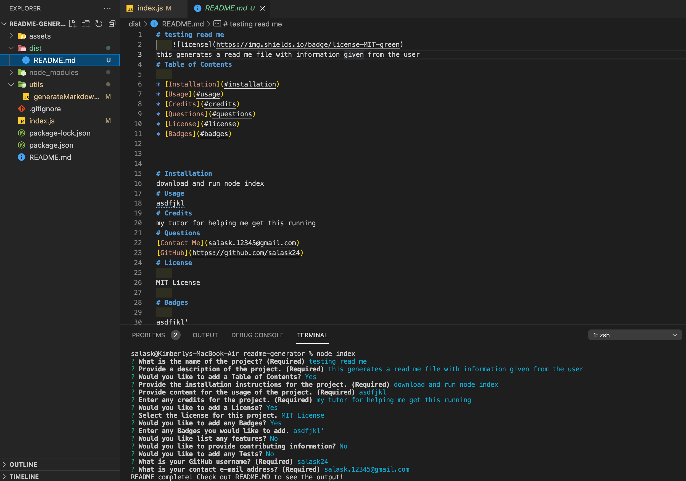

# README-Generator

# Description

GIVEN a command-line application that accepts user input
WHEN prompted for information about application repository
THEN a high-quality, professional README.md is generated with the title of my project and sections entitled Description, Table of Contents, Installation, Usage, License, Contributing, Tests, and Questions

# Installation:
Clone the repository and run 'node index' in command line

# Credits

My tutor and fellow classmates for the additional help.

# Screenshot

# Links

Github repo: https://github.com/salask24/readme-generator  
Live Link: https://salask24.github.io/readme-generator/ 
Command line Demo: https://drive.google.com/file/d/1uVXO8_N0jOTauJ_1N_J0lHA3GN3TyDh6/view?usp=sharing  

# Questions

Feel free to reach out through email: salask.0104@gmail.com